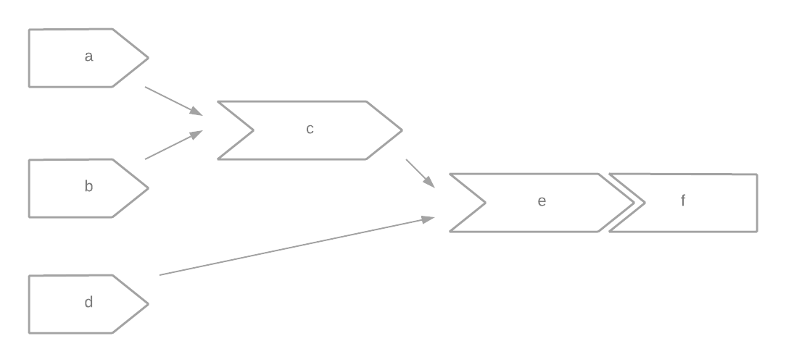
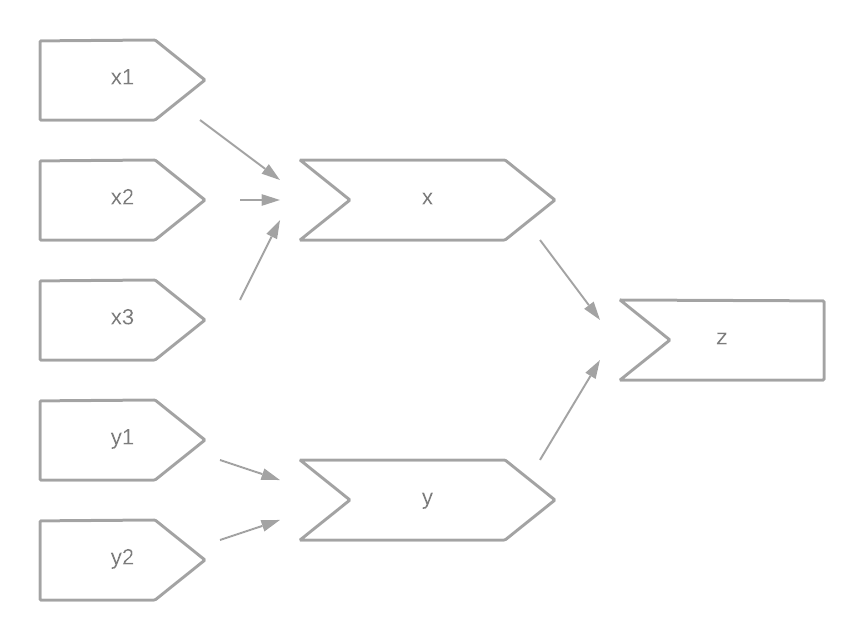
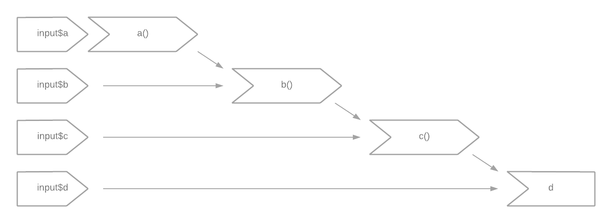

```{r setup, include=FALSE}
knitr::opts_chunk$set(echo = TRUE)
```


```{r, echo=FALSE}
library(shiny)
```

## 3.3.6 Exercises

### 1. Given this UI:

```{r, eval=FALSE}
ui <- fluidPage(
  textInput("name", "What's your name?"),
  textOutput("greeting")
)
```

Fix the simple errors found in each of the three server functions below. First try spotting the problem just by reading the code; then run the code to make sure you've fixed it.

```{r, eval=FALSE}
server1 <- function(input, output, server) {
  input$greeting <- renderText(paste0("Hello ", name))
}

server2 <- function(input, output, server) {
  greeting <- paste0("Hello ", input$name)
  output$greeting <- renderText(greeting)
}

server3 <- function(input, output, server) {
  output$greting <- paste0("Hello", input$name)
}
```

#### Answer

##### server1

```{r}
ui <- fluidPage(
  textInput("name", "What's your name?"),
  textOutput("greeting")
)

server <- function(input, output, server) {
    output$greeting <- renderText(paste0("Hello ", input$name))
}

shinyApp(ui, server)
```

##### server2

```{r}
ui <- fluidPage(
  textInput("name", "What's your name?"),
  textOutput("greeting")
)

server <- function(input, output, server) {
    string <- reactive(paste0("Hello ", input$name))
    output$greeting <- renderText(string())
}

shinyApp(ui, server)
```

##### server3

```{r}
ui <- fluidPage(
  textInput("name", "What's your name?"),
  textOutput("greeting")
)

server <- function(input, output, server) {
    output$greeting <- reactive(paste0("Hello ", input$name))
}

shinyApp(ui, server)
```

### 2. Draw the reactive graph for the following server functions:

```{r, eval=FALSE}
server1 <- function(input, output, session) {
  c <- reactive(input$a + input$b)
  e <- reactive(c() + input$d)
  output$f <- renderText(e())
}
server2 <- function(input, output, session) {
  x <- reactive(input$x1 + input$x2 + input$x3)
  y <- reactive(input$y1 + input$y2)
  output$z <- renderText(x() / y())
}
server3 <- function(input, output, session) {
  d <- reactive(c() ^ input$d)
  a <- reactive(input$a * 10)
  c <- reactive(b() / input$c) 
  b <- reactive(a() + input$b)
}
```

#### Answer

##### server1



##### server2



##### server3



### 3. Why will this code fail?

```{r, eval=FALSE}
var <- reactive(df[[input$var]])
range <- reactive(range(var(), na.rm = TRUE))
```

#### Answer

`range()` and `var()` are already function names and should not be used for user-defined functions.

